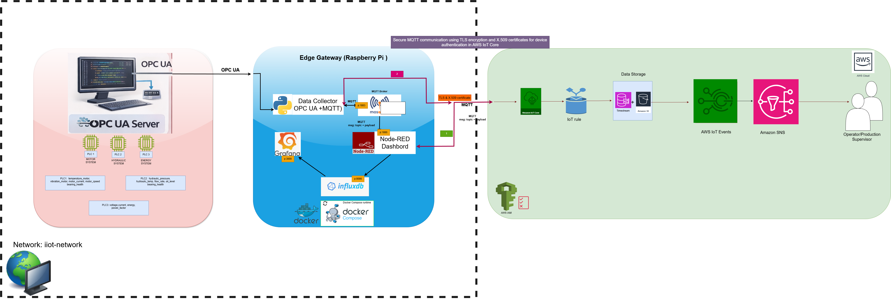

# TP 00 - Découverte de l’architecture Smart Factory

---

## 🎯 Objectifs pédagogiques

À la fin de ce TP, vous serez capable de :

* Comprendre ce qu’est une architecture IoT industrielle
* Identifier les différentes couches (OT, Edge, Cloud)
* Comprendre le flux de données de bout en bout
* Identifier les technologies utilisées

---

## Contexte

Dans l’industrie moderne ou Smart Factory (Industry 4.0), les machines génèrent en continu des données.

Ces données doivent être :

* collectées
* transportées
* transformées
* stockées
* visualisées
* exploitées dans le cloud

Dans ce projet, nous allons construire une **Smart Factory complète**, de la machine jusqu’au cloud.

---

## 🏗️ Architecture de base


Le système est structuré en trois couches :

---

### 🏭 1. Couche OT (Operational Technology)

Elle représente le monde industriel :

* automates (PLC)
* capteurs
* machines

Dans ce projet :

* simulation de PLC avec Python
* exposition des données via OPC-UA

---

### 🌉 2. Couche Edge Gateway

Elle agit comme un pont entre OT et IT.

Elle permet de :

* collecter les données
* transformer les données
* stocker localement
* visualiser en temps réel

Technologies utilisées :

* Raspberry Pi
* Docker
* MQTT (Mosquitto)
* Node-RED
* InfluxDB
* Grafana

---

### ☁️ 3. Couche Cloud

Elle permet de :

* centraliser les données
* analyser les données
* générer des alertes

Technologies utilisées :

* AWS IoT Core
* S3
* SNS

---

## 🔄 Flux de données

```
PLC → OPC-UA → Data Collector → MQTT → Node-RED → InfluxDB → Grafana
                                                      ↓
                                                   Cloud
```

---

## Instructions

Notre Architecture de base est materialisée comme suit:


👉 Lisez attentivement les sections ci-dessus puis réalisez les exercices suivants :

---

### 🧠 Exercice 1 — Compréhension des couches

1. Identifiez les 3 couches de l’architecture de base
2. Donnez le rôle principal de chaque couche

---

### 🔍 Exercice 2 — Analyse du flux

Expliquez avec vos mots le chemin d’une donnée depuis la machine jusqu’au cloud.

---

### ⚙️ Exercice 3 — Technologies

Associez chaque technologie à son rôle :

* OPC-UA
* MQTT
* Node-RED
* InfluxDB
* Grafana

---

### 🧩 Exercice 4 — Réflexion

Répondez aux questions suivantes :

1. Quelle est la différence entre IT et OT ?
2. Pourquoi ne pas envoyer directement les données au cloud ?
3. Quel est l’intérêt de l’Edge Gateway ?

---

## ✅ Résultat attendu

À la fin de ce TP :

* Vous comprenez l’architecture complète
* Vous savez expliquer le flux de données
* Vous êtes prêt pour les TP techniques suivants

---

## 🚀 Bonus (optionnel)

* Rechercher ce qu’est Industrie 4.0
* Quelle est la relation entre  Smart Factory et Industrie 4.0?
* Quels sont les piliers de l'industrie 4.0?
