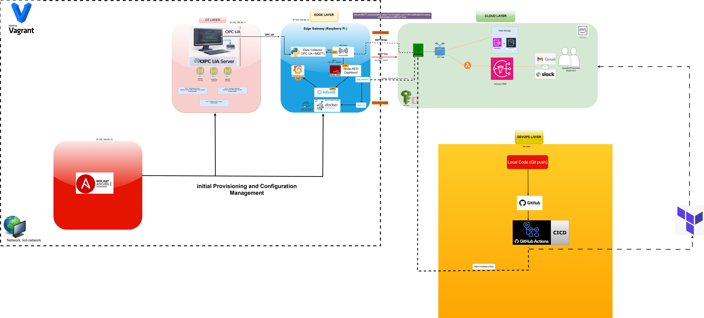

# TP 00 - Découverte de l’architecture Smart Factory

---

## Objectifs pédagogiques

À la fin de ce TP, vous serez capable de :

* Comprendre ce qu’est une architecture IoT industrielle
* Identifier les différentes couches d’une architecture IoT industrielle
* Comprendre le flux de données de bout en bout
* Identifier les technologies utilisées

---

## Contexte

Dans l’industrie moderne (Smart Factory / Industry 4.0), les machines génèrent en continu des données.

Ces données doivent être :

* collectées
* transportées
* transformées
* stockées
* visualisées
* exploitées dans le cloud

Dans ce projet, nous allons construire une **Smart Factory complète**, de la machine jusqu’au cloud.

---

## Architecture de base

Notre architecture est représentée ci-dessous :

---

## Instructions

À partir du schéma ci-dessus, répondez aux questions suivantes.

---

### Exercice 1 — Analyse de l’architecture

1. Combien de grandes parties (couches) observez-vous dans cette architecture ?
2. Décrivez brièvement le rôle de chaque partie

---

### Exercice 2 — Flux de données

1. D’où viennent les données ?
2. Par quelles étapes passent-elles ?
3. Où sont-elles stockées ?
4. Où sont-elles visualisées ?

---

### Exercice 3 — Identification des technologies

À partir du schéma, associez chaque technologie à son rôle :

* OPC-UA
* MQTT
* Node-RED
* InfluxDB
* Grafana

---

### Exercice 4 — Réflexion

1. Pourquoi ne pas envoyer directement les données des machines vers le cloud ?
2. Quel pourrait être le rôle d’un système intermédiaire (gateway) ?
3. Quels problèmes pourraient apparaître sans cette architecture ?

---

## Bonus (optionnel)

Répondez aux questions suivantes :

1. L’intégration IT/OT est un pilier clé de l’Industrie 4.0. Expliquez pourquoi.
2. Pouvez-vous citer d’autres piliers de l’Industrie 4.0 ?
3. Quelle est la différence entre IT et OT ?
4. Pourquoi l’intégration IT/OT prend-elle autant d’ampleur ?
5. Quels sont les principaux cas d’usage de l’intégration IT/OT ?
6. Quelle est la relation entre Smart Factory et Industrie 4.0 ?

---
