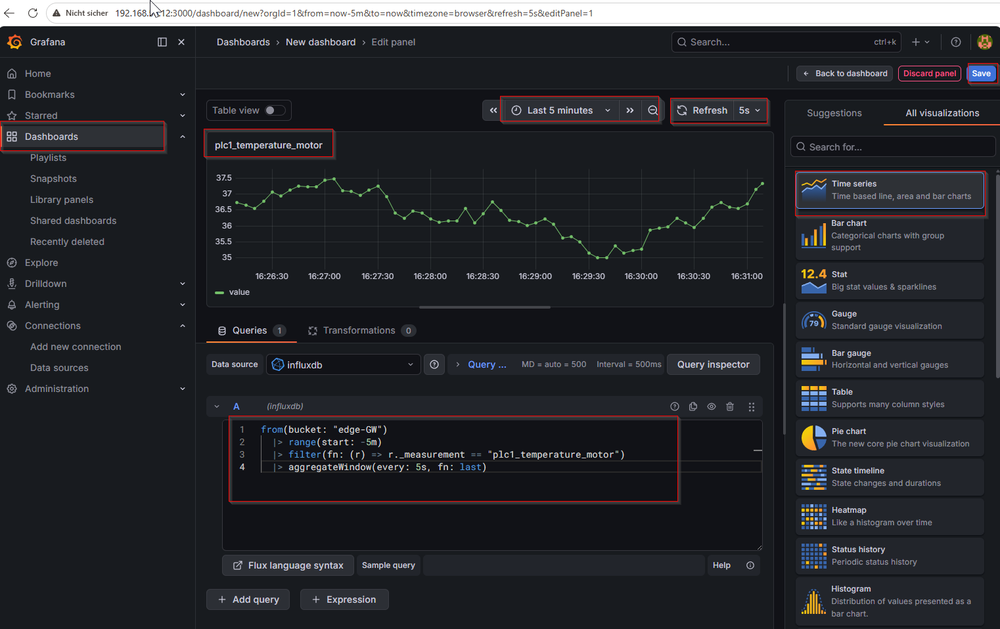
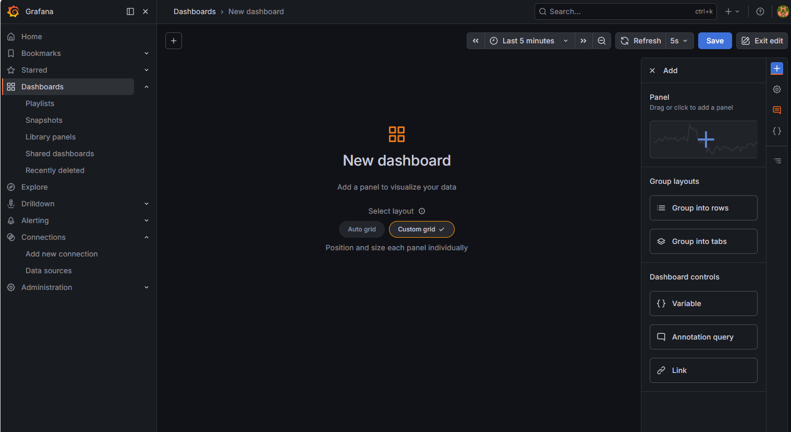
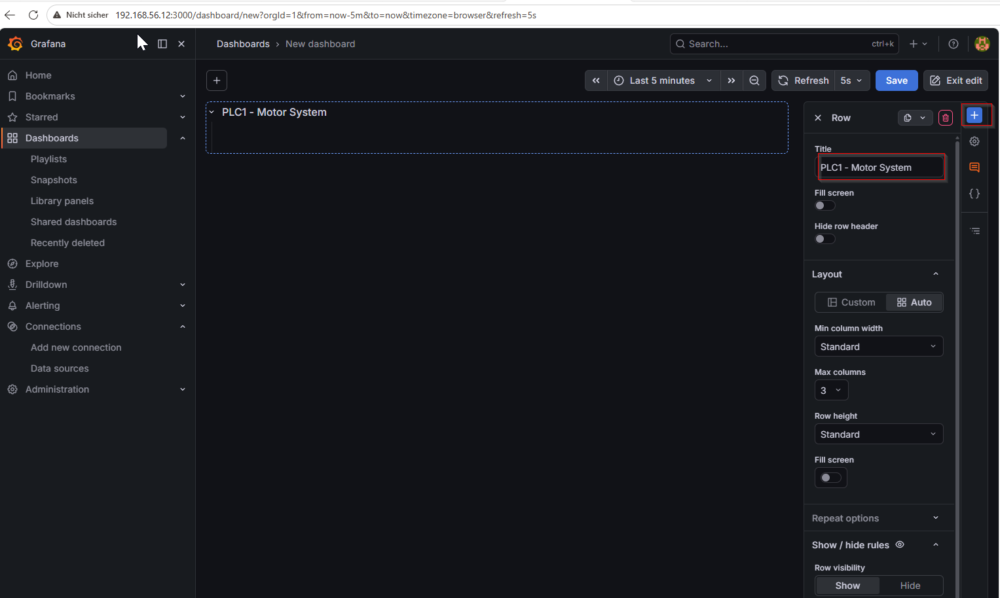
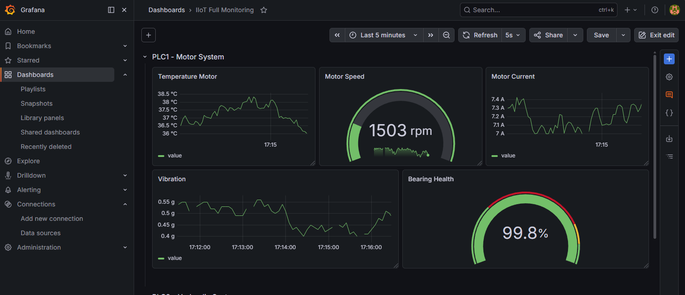
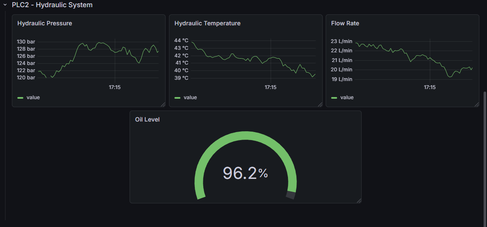
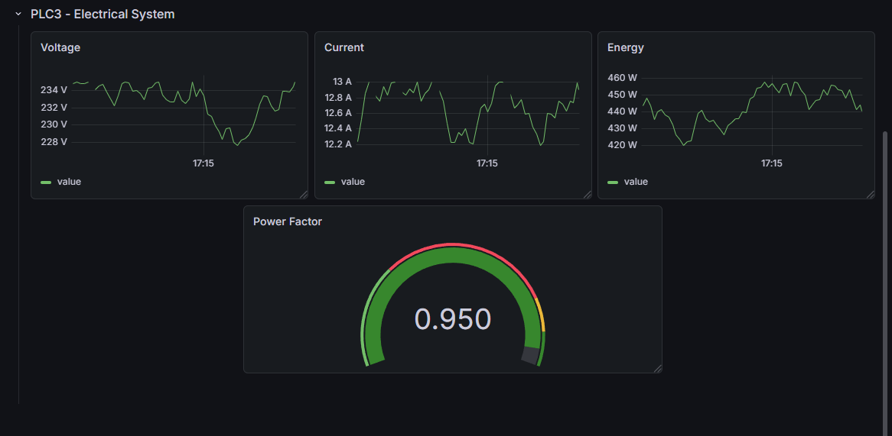
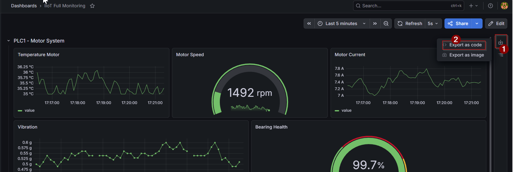
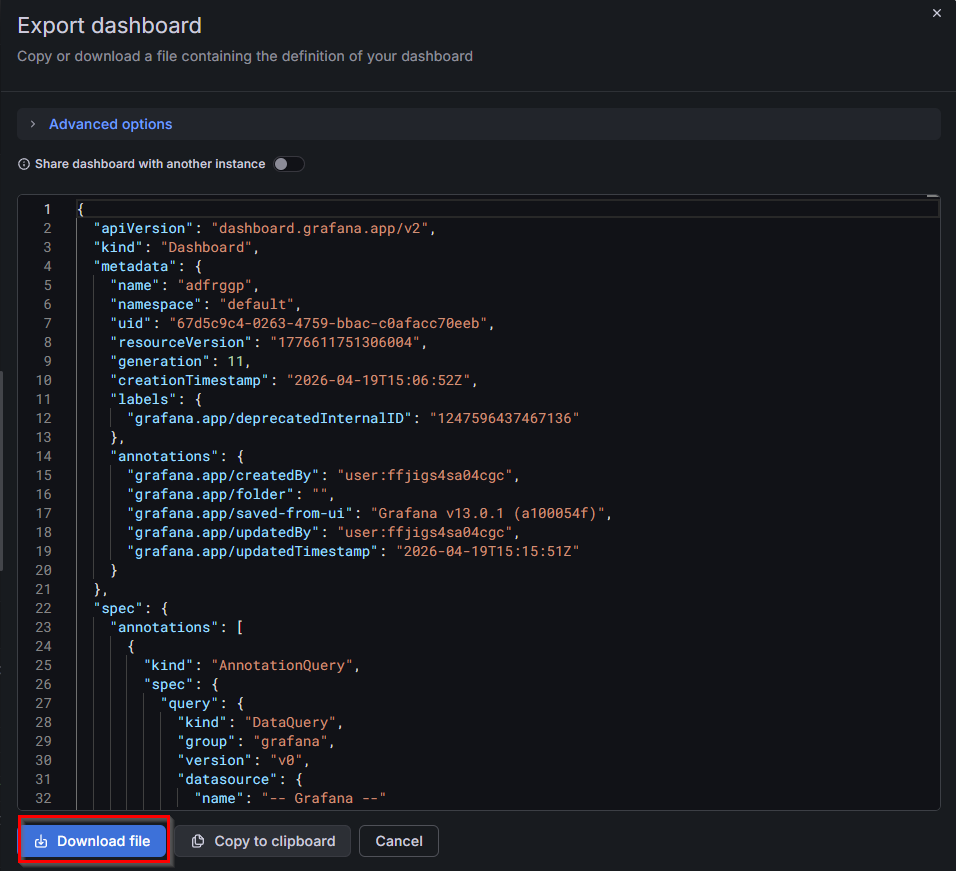

# Corrigé — TP 08 : Grafana (Monitoring & Visualisation IoT)

---

## Compréhension globale

Dans ce TP, nous avons ajouté la dernière brique de notre architecture IoT :

👉 la visualisation des données

---

## Position dans l’architecture

```text
PLC → OPC UA → MQTT → Node-RED → InfluxDB → Grafana
````

👉 Grafana permet de :

* transformer les données en graphiques
* surveiller les systèmes
* détecter des anomalies

---

# Étape 1 — Création du volume

---

```bash
docker volume create grafana-storage
```

---

## Pourquoi ?

👉 Permet de :

* sauvegarder les dashboards
* conserver les configurations
* éviter la perte de données

---

# Étape 2 — Déploiement Grafana

---

```bash
docker run -d \
  --name grafana \
  --network iiot-network \
  -p 3000:3000 \
  -v grafana-storage:/var/lib/grafana \
  --restart unless-stopped \
  grafana/grafana
```

---

## Vérification

```bash
docker ps
```

---

👉 Le conteneur doit être **Up**

---

# Étape 3 — Accès à Grafana

---

```text
http://192.168.56.12:3000
```

---

## Connexion

* Username : admin
* Password : admin

👉 Changer le mot de passe

---

# Étape 4 — Configuration InfluxDB

---

## Paramètres

| Champ  | Valeur                                       |
| ------ | -------------------------------------------- |
| URL    | [http://influxdb:8086](http://influxdb:8086) |
| Org    | iiot                                         |
| Bucket | edge-GW                                      |
| Token  | token InfluxDB valide  ici my-supertoken     |

---

## Important

👉 Utiliser :

```text
http://influxdb:8086
```

❌ Pas localhost
❌ Pas IP

👉 car communication via réseau Docker

---

## Test

👉 Cliquer sur **Save & Test**

Résultat :

```text
Data source is working
```

---

# Étape 5 — Création d’un Dashboard

## Étapes

1. Aller dans **Dashboards → New Dashboard**
2. Cliquer sur **Add new panel**
3. Donner un titre au panel
4. cliquer sur Configure Visualization ensuite
5. copier le flux ci-dessus

```flux
from(bucket: "edge-GW")
  |> range(start: -5m)
  |> filter(fn: (r) => r._measurement == "plc1_temperature_motor")
  |> aggregateWindow(every: 5s, fn: last)
```
---
Explication

* `from` → source de données
* `range` → période
* `filter` → sélection du capteur
* `aggregateWindow` → agrégation 👉 évite surcharge

 ❌ Sans agrégation :
* trop de points affichés
* surcharge Grafana
* graphiques illisibles

Les fonctions principales
🔹 last()

👉 Prend la dernière valeur reçue

✔ idéal pour :

monitoring temps réel
température actuelle
état machine

👉 Exemple :

Température actuelle = dernière mesure reçue
🔹 mean()

👉 Calcule la moyenne sur la fenêtre

✔ idéal pour :

lisser les données
éviter le bruit (noise industriel)

👉 Exemple :

Température moyenne sur 5 secondes
---

6. cliquer sur Refresh et vous aurrez le resulat suivant:



---

# Étape 6 — Dashboard multi-PLC

---

## Organisation recommandée

---

### 🔧 PLC1 — Motor System

* Temperature
* Vibration
* Motor Current
* Motor Speed
* Bearing Health

---

### 💧 PLC2 — Hydraulic System

* Pressure
* Temperature
* Flow Rate
* Oil Level

---

### ⚡ PLC3 — Energy Monitoring

* Voltage
* Current
* Energy
* Power Factor

---

## Bonne pratique

👉 Un panel = une mesure

👉 Organisation par système industriel

---

## Résultat

👉 Dashboard lisible et structuré

---

# Étape 7 — Export du Dashboard

---

## Étapes

1. Aller dans Dashboard settings
2. Cliquer sur JSON Model
3. Copier le JSON

---

## Pourquoi ?

👉 permet :

* sauvegarde
* versionning
* réutilisation

---

# Étape 8 — Alerting

---

## Exemple

Créer une alerte :

```text
Température > 80°C
```

---

## Étapes

1. Ouvrir un panel
2. Aller dans Alert
3. Ajouter une règle

---

## Exemple de condition

* last() > 80
* période : 1 min

---

## Résultat

👉 Détection automatique d’anomalie

---

# Étape 9 — Export des alertes

---

1. Aller dans Alert rules
2. Sélectionner l’alerte
3. Export JSON

---

# Réponses aux exercices

---

## Exercice 1 — Dashboard multi-PLC

1. Aller dans **Dashboards → New Dashboard**

2. Cliquer sur **Group into rows**  


3. Donner un titre au premier group (Row) :  
👉 **PLC1 - Motor System**

4. Ajouter les autres Rows :  
👉 **PLC2 - Hydraulic System**  
👉 **PLC3 - Electrical System**  



5. Cliquer sur un group (Row), puis sur **Add panel**, comme montré dans l’exemple précédent

6. Adapter les requêtes Flux pour chaque capteur (temperature, vibration, etc.)

7. Résultat attendu :







---

## Export du Dashboard

👉 Pour faciliter un nouveau déploiement :

1. Aller sur l’interface du Dashboard  
2. Cliquer sur **Export**





---

# Problèmes fréquents

---

## 1. Grafana inaccessible

```bash
docker ps
```

👉 vérifier port 3000

---

## 2. Data source KO

👉 vérifier :

* token
* org
* bucket

---

## 3. Pas de données

👉 vérifier :

* Node-RED
* InfluxDB
* requête Flux

---

## 4. Mauvais réseau

```bash
docker network inspect iiot-network
```

👉 grafana et influxdb doivent être présents

---

# Architecture finale

---

```text
PLC → OPC UA → MQTT → Node-RED → InfluxDB → Grafana
```

---

👉 Pipeline complet :

✔ acquisition
✔ transport
✔ traitement
✔ stockage
✔ visualisation

---

# Conclusion

Dans ce TP, vous avez :

* déployé Grafana
* connecté InfluxDB
* créé des dashboards
* mis en place du monitoring

