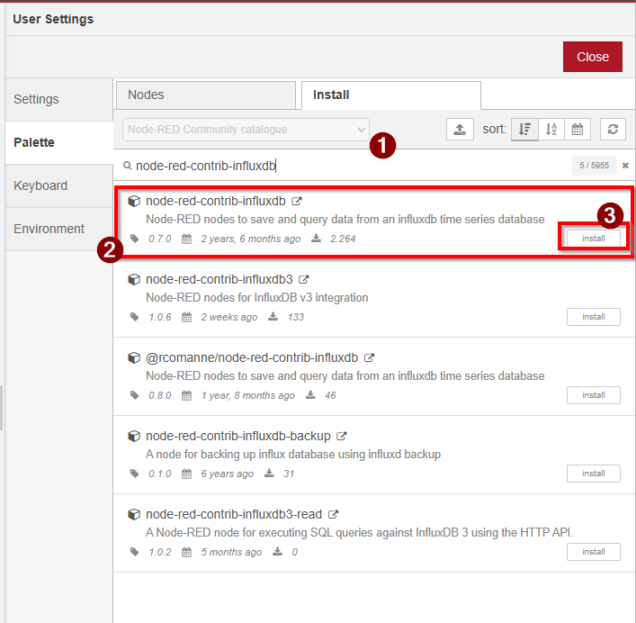
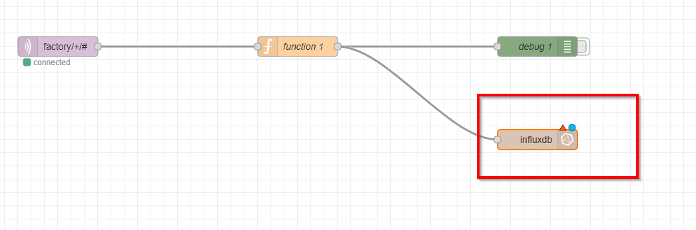
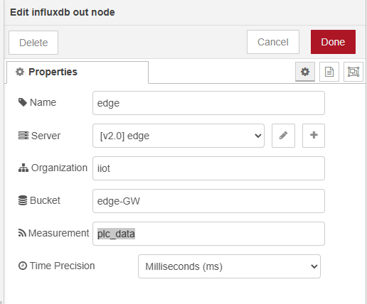
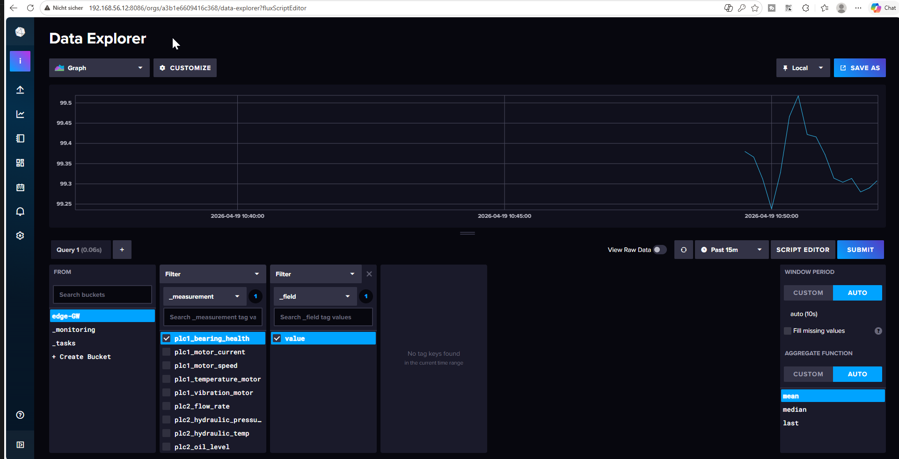

# Corrigé — TP 07 : Envoi des données Node-RED vers InfluxDB

---

## Compréhension globale

Dans ce TP, nous avons connecté Node-RED à InfluxDB afin de stocker les données IoT.

👉 Node-RED joue ici le rôle de :

* transformation des données
* client d’écriture vers InfluxDB

---

## Position dans l’architecture

```text
PLC → OPC UA → Data Collector → MQTT → Node-RED → InfluxDB
````

👉 InfluxDB devient la base de données finale.

---

# Étape 1 — Installation du node InfluxDB

---

Dans Node-RED :

1. Menu → **Manage Palette**
2. Onglet **Install**
3. Installer :

```text id="install-node"
node-red-contrib-influxdb
```

---

## Vérification

👉 Le node **influxdb out** doit apparaître dans la palette

---

# Étape 2 — Mise à jour du flow

---

## Flow final

```text id="flow-final"
MQTT → Function → InfluxDB OUT
```


---

👉 Le node **Function** prépare les données
👉 Le node **InfluxDB OUT** envoie les données

---

# Étape 3 — Configuration du node InfluxDB

---

## Paramètres

* URL : `http://influxdb:8086`
* Token : `my-super-token`
* Organisation : `iiot`
* Bucket : `edge-GW`
* Measurement : `plc_data`




---


## Pourquoi ça fonctionne ?

👉 Grâce au réseau Docker :

* Node-RED peut accéder à `influxdb`
* pas besoin d’IP

---

# Étape 4 — Format des données (CRITIQUE)

---

## Données envoyées

Le node Function doit produire :

```json id="payload-correct"
{
  "measurement": "plc1_temperature_motor",
  "value": 45.2,
  "timestamp": 1710000000
}
```

---

## Explication

* measurement → nom de la métrique
* value → valeur numérique
* timestamp → temps de mesure

---

## Point important

👉 La valeur doit être un **nombre**

Sinon :

❌ erreur d’écriture
❌ données ignorées

---

# Étape 5 — Vérification dans InfluxDB

---

Accéder à :

```text id="influx-access"
http://192.168.56.12:8086
```
se connecter á influxdb avec les credentials définr dans la fichier .env.
---

## Data Explorer

Vérifier :

* présence du bucket `edge-GW`
* apparition des mesures
* évolution des données


---

# Réponses aux objectifs

---

## Pourquoi InfluxDB fonctionne ici ?

Parce que :

* Node-RED envoie des données formatées
* InfluxDB est optimisé pour time-series

---

## Pourquoi utiliser Node-RED ?

* transformation des données
* préparation du format
* envoi vers base

---

## Pourquoi un timestamp ?

👉 permet :

* historique
* graphiques
* analyse temporelle

---

# Problèmes fréquents

---

## 1. Aucune donnée dans InfluxDB

Vérifier :

* Node-RED connecté
* flow actif (Deploy)
* Function node correct

---

## 2. Mauvais token

👉 erreur d’authentification

Solution :

* vérifier `.env`
* vérifier config Node-RED

---

## 3. Mauvais bucket / org

👉 aucune donnée visible

---

## 4. Problème réseau Docker

```bash id="net-debug"
docker network inspect iiot-network
```

👉 node-red et influxdb doivent être présents

---

## 5. Valeur incorrecte

👉 NaN ou string

Solution :

* convertir en Number()
* nettoyer les données

---

# Architecture finale

---

```text id="arch-complete"
PLC → OPC UA → MQTT → Node-RED → InfluxDB
```

---

👉 Les données sont maintenant :

✔ collectées
✔ transportées
✔ transformées
✔ stockées

---

# Conclusion

Dans ce TP, vous avez :

* connecté Node-RED à InfluxDB
* envoyé des données time-series
* validé le stockage

---

👉 Votre pipeline IoT est maintenant complet côté données.

---

## Prochaine étape

👉 Visualisation avec Grafana

---

