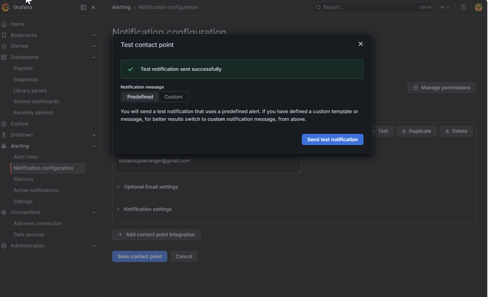
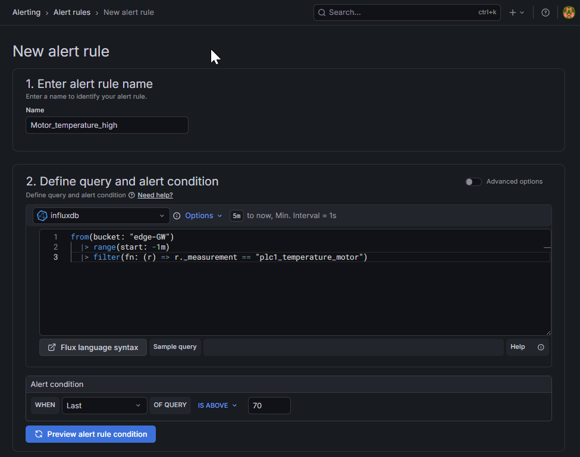
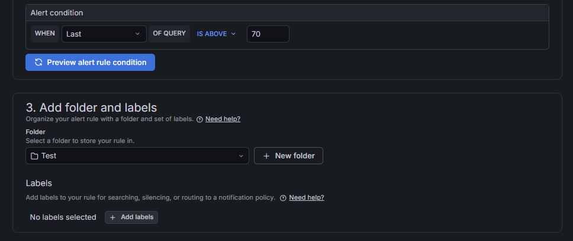
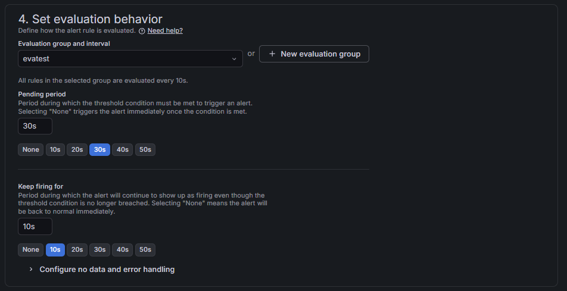
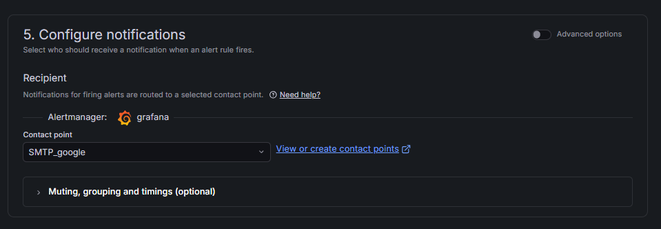
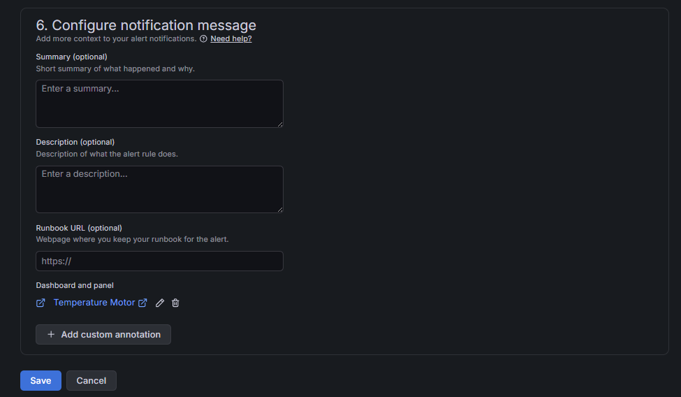
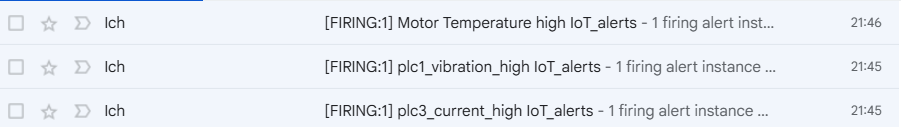

# Corrigé — TP 09 Grafana Alerting (version finale)

---

# Partie 1 — Validation SMTP

---

## ✔ Résultat attendu

👉 Le contact point email doit fonctionner :

* test envoyé depuis Grafana ✔
* email reçu ✔



---

##  Erreurs fréquentes corrigées

* mauvais mot de passe Gmail ❌
* App password non utilisé ❌
* Grafana non relancé ❌

---

# Partie 2 — Alerte simple (PLC1 Temperature High)

---

## ✔ Configuration correcte

| Paramètre   | Valeur                 |
| ----------- | ---------------------- |
| Measurement | plc1_temperature_motor |
| Reduce      | last                   |
| Threshold   | >70                    |
| For         | 30s                    |
| Pending     | 30s                    |
| Keep firing | 10s                    |

---

## ✔ Query correcte

```flux id="q1"
from(bucket: "edge-GW")
  |> range(start: -1m)
  |> filter(fn: (r) => r._measurement == "plc1_temperature_motor")
```
---






## Export du fichier alerting au format YAML

-


# Partie 2 — Exercice avancé (YAML final)

---

##  Objectif

👉 3 alertes dans un seul fichier :

* température > 60
* vibration > 3
* courant hors plage [8 ; 13]

-

---


# Résultat attendu

---

✔ alertes visibles dans Grafana
✔ état Pending → Firing → Resolved
✔ emails reçus



✔ YAML réutilisable

# 🚀 Étape suivante

👉 TP10 = **Docker Compose + provisioning automatique**

