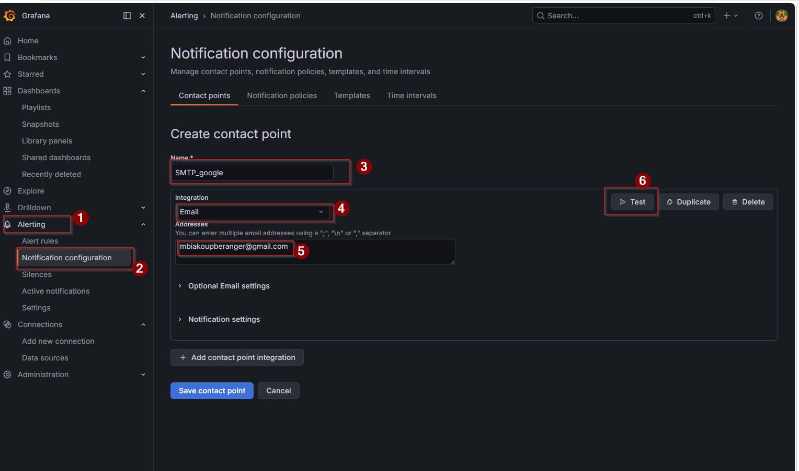

# TP 09 — Grafana Alerting (Configuration manuelle)

---

## 🎯 Objectifs pédagogiques

À la fin de ce TP, vous serez capable de :

* Configurer l’envoi d’emails dans Grafana
* Créer des alertes manuellement
* Manipuler le pipeline **A → B → C**
* Mettre en place un monitoring automatique

---

## 🧠 Contexte

Architecture :

```text
PLC → OPC UA → MQTT → Node-RED → InfluxDB → Grafana
```

👉 Les dashboards sont disponibles
👉 Les données sont visibles
👉 MAIS aucune alerte automatique

---

## ❌ Problème

* Surveillance manuelle
* Aucun système de détection automatique

---

## ✅ Objectif du TP

👉 Mettre en place un système d’alerting complet :

* détection
* décision
* notification

---

# ⚙️ Partie 1 — Configuration SMTP

---

## Étapes

### 1. Modifier le fichier `.env`

```env
GF_SMTP_ENABLED=true
GF_SMTP_HOST=smtp.gmail.com:587
GF_SMTP_USER=your_email@gmail.com
GF_SMTP_PASSWORD=your_app_password
GF_SMTP_FROM_ADDRESS=your_email@gmail.com
GF_SMTP_FROM_NAME=grafana
```

---

### 2. Générer un App Password

👉 [https://myaccount.google.com/apppasswords](https://myaccount.google.com/apppasswords)

---

### 3. Relancer Grafana

```bash
docker rm -f grafana
```

```bash
docker run -d \
  --name grafana \
  --network iiot-network \
  -p 3000:3000 \
  -v grafana-storage:/var/lib/grafana \
  --env-file .env \
  --restart unless-stopped \
  grafana/grafana
```

---

### 4. Créer un Contact Point Email

1. Aller dans **Alerting → Contact points**
2. Cliquer sur **New contact point**
3. Type : **Email**
4. Ajouter votre adresse email
5. Cliquer sur **Test**



---

## ✅ Résultat attendu

👉 Email de test reçu

---

# 🚨 Partie 2 — Création d’une alerte simple

---

## Étapes

1. Ouvrir un panel (température moteur)
2. Cliquer sur **Edit**
3. Aller dans l’onglet **Alert**
4. Cliquer sur **New alert rule**
5. Définir une condition d'alerte
6. Ajouter un label
7. Definir l'evaluation de la regle
8. Configuration de notification


---

## Contraintes

* Measurement : `plc1_temperature_motor`
* Reduce : `last`
* Threshold : `> 70`
* For : `30s`

---

## Définir une condition d'alerte

```text
WHEN [last] OF QUERY IS ABOVE [70]
```

---

## Definir l'evaluation de la regle

* **Pending period** : 30s
* **Keep firing for** : 10s

---

## Configuration de notification

* Selectioner le contact point crée plus haut lors de la Configuration SMTP

# 🧪 Partie 3 — Exercice avancé

---

Créer un groupe d’alertes contenant :

---

### 🔧 Température moteur

* Measurement : `plc1_temperature_motor`
* Condition :

```text
> 60°C
```

---

### ⚙️ Vibration moteur

* Measurement : `plc1_vibration_motor`
* Condition :

```text
> 3g
```

---

### ⚡ Courant moteur

* Measurement : `plc1_motor_current`
* Condition :

```text
valeur hors plage [8 ; 13]
```

---

## 🎯 Attendu

👉 Exporter toutes les alertes en **un seul fichier YAML**

---

# ✅ Résultat attendu

---

* alertes actives ✔
* emails reçus ✔
* export YAML réalisé ✔

---

# 🔭 Vision globale

---

```text
PLC → OPC UA → MQTT → Node-RED → InfluxDB → Grafana → Alerting → Email
```
